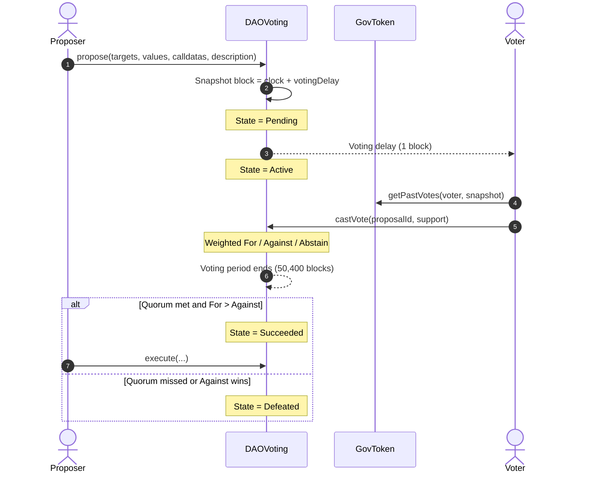

# DAO Voting DApp - Decentralized Governance Protocol

[](https://github.com/Abdul100-han/DAO-Voting-DApp/actions/workflows/test.yml)
[](https://soliditylang.org/)
[](https://sepolia.etherscan.io/)

On-chain governance for a token-weighted DAO: an OpenZeppelin Governor, an `ERC20Votes` token, and a Next.js App Router client for proposals, delegation, and voting on Sepolia.

## Architecture & System Design

Proposals move through a fixed Governor clock. Voting power is snapshotted **before** the vote starts, so later transfers cannot rewrite the outcome.



| Layer | Role |
| --- | --- |
| `GovToken` | ERC-20 + EIP-2612 permit + `ERC20Votes` checkpoints |
| `DAOVoting` | Governor with 4% quorum, simple counting, no timelock |
| Frontend | Wallet connection, delegation, proposal feed, vote UI |

## Tech Stack

| Area | Tools |
| --- | --- |
| Smart Contracts | Solidity `^0.8.20` (compiled with 0.8.28), Foundry, OpenZeppelin (`ERC20Votes`, `Governor`, `GovernorCountingSimple`, `GovernorVotesQuorumFraction`) |
| Frontend | Next.js (App Router), TypeScript, Tailwind CSS |
| Web3 Integration | Wagmi v2, Viem, RainbowKit, TanStack Query |
| Infrastructure | Alchemy (Sepolia RPC), Etherscan API / Sepolia explorer |

## Deployed Smart Contract Addresses (Sepolia)

| Contract | Address | Explorer |
| --- | --- | --- |
| GovToken | [`0x0b90Ec52dda3814B8d3A6021F8e3C5d663AD4936`](https://sepolia.etherscan.io/address/0x0b90Ec52dda3814B8d3A6021F8e3C5d663AD4936) | Sepolia Etherscan |
| DAOVoting | [`0x4e0fFBb9c95Ad2bb2bf3Af6746551a3357F84756`](https://sepolia.etherscan.io/address/0x4e0fFBb9c95Ad2bb2bf3Af6746551a3357F84756) | Sepolia Etherscan |

Update these values in `frontend/.env.local` if you redeploy.

## Local Development Setup

### Prerequisites

- [Node.js](https://nodejs.org/) 20+
- [Foundry](https://book.getfoundry.sh/getting-started/installation) (`forge`, `cast`, `anvil`)
- A Sepolia RPC URL (Alchemy) and a [WalletConnect / Reown](https://cloud.reown.com) project ID for the frontend

### Smart contracts

```bash
git clone https://github.com/Abdul100-han/DAO-Voting-DApp.git
cd DAO-Voting-DApp/contract

forge build
forge test -vvv
```

Copy `contract/.env.example` to `contract/.env` and set `SEPOLIA_RPC_URL`, `PRIVATE_KEY`, and `ETHERSCAN_API_KEY` before broadcasting:

```bash
forge script script/DeployDAO.s.sol --rpc-url sepolia --broadcast --verify
```

### Frontend

```bash
cd frontend
cp .env.example .env.local
# set NEXT_PUBLIC_ALCHEMY_SEPOLIA_URL, NEXT_PUBLIC_WALLET_CONNECT_PROJECT_ID,
# NEXT_PUBLIC_GOV_TOKEN_ADDRESS, and NEXT_PUBLIC_DAO_VOTING_ADDRESS

npm install
npm run dev
```

Open [http://localhost:3000](http://localhost:3000). Connect a wallet on Sepolia, delegate GT, then create and vote on proposals.

## Key Technical Features

### Checkpointed votes (`getPastVotes`)

`GovToken` inherits OpenZeppelin `ERC20Votes`. Token balance is **not** voting power until the holder delegates. Each transfer and delegate writes a checkpoint keyed by block number.

The Governor reads `getPastVotes(account, proposalSnapshot)` at the snapshot timepoint, not the live balance. Buying tokens after a proposal is created (including with a flash loan in the same block as a vote) does not increase that proposal’s weight.

### On-chain proposal state and event feed

`DAOVoting.state(proposalId)` returns the Governor enum (`Pending`, `Active`, `Canceled`, `Defeated`, `Succeeded`, `Queued`, `Expired`, `Executed`). The UI maps those integers to status badges.

The proposal list does not keep a centralized database. It queries `ProposalCreated` logs on Sepolia with Viem (`getContractEvents`), then reads `state` for each `proposalId`. Creating a proposal invalidates that query so the feed updates after the transaction confirms.

## Repository Layout

```text
contract/     Foundry project (GovToken, DAOVoting, tests, deploy script)
frontend/     Next.js App Router client (Wagmi + RainbowKit)
```

## License

MIT
